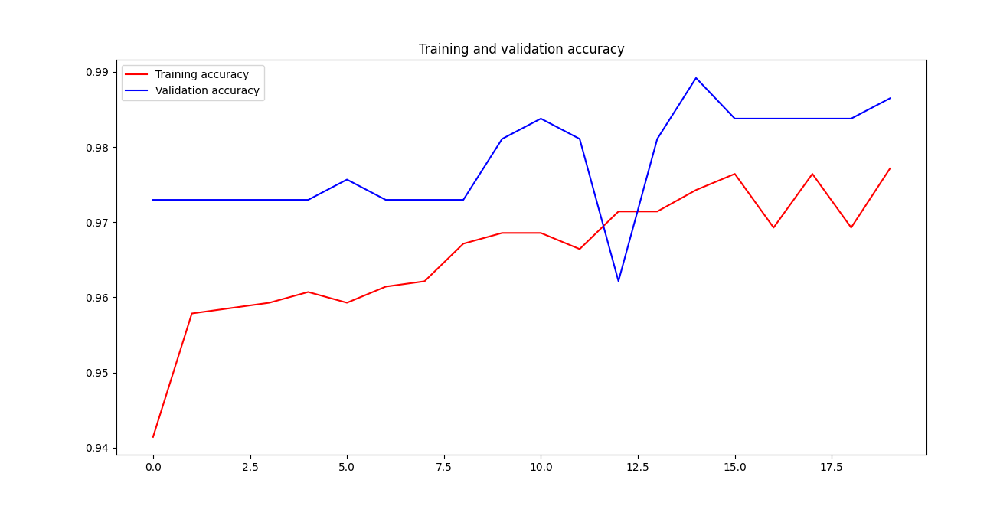
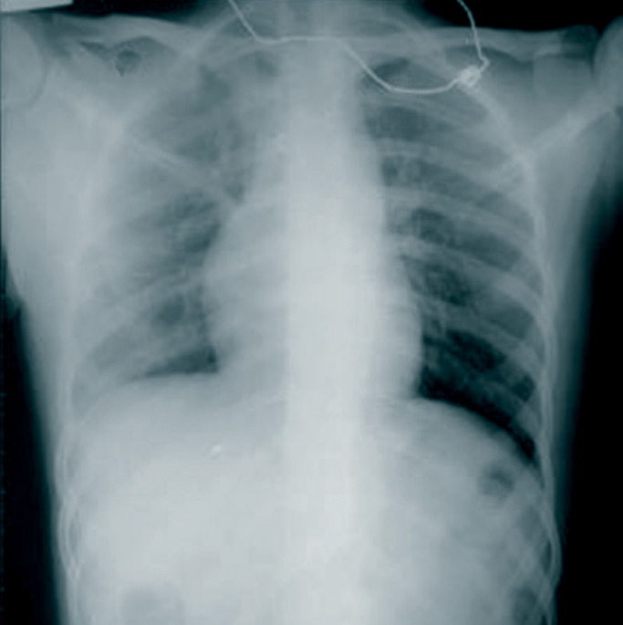

# CORONA_HACKBOOK

A Deep Learning Algorithm to predict if the chest x-ray scans are of  covid19 positive person or not .


The Training History .



## Getting Started
- Clone the repo and cd into the directory
```sh
$ git clone https://github.com/raj713335/CORONA_HACKBOOK.git
$ cd CORONA_HACKBOOK
```

## Download the training and testing dataset images from the following url and place it into the CORONA_HACKBOOK FOLDER

$ https://drive.google.com/u/0/uc?export=download&confirm=7AMh&id=1XjSuZZsFGwH7SpnIPYbw_bRgkP4-ntxw


## Install tensorflow and all the other required libraries 

```sh
$ pip install tensorflow, keras 

import tensorflow as tf
import keras_preprocessing
from keras_preprocessing import image
from keras_preprocessing.image import ImageDataGenerator
```


# A X-Ray Report Example .




## Run the coronovirus.py file to train a model and save it as coronovirus.py

```sh
$ python coronavirus.py
```

## Download The Trained Model From the Following link in case you don't have the computational power to train your model

$ url : https://drive.google.com/u/0/uc?id=1112evrjqWlEPw1hkPA44LoVfm_USuys8&export=download


## To load and run the model and test it against unknown data\images place you test images in the OUTPUT Folder with 1.jpg/1.jpeg name with it.


```sh
$ python coronovirus_validate.py
```

